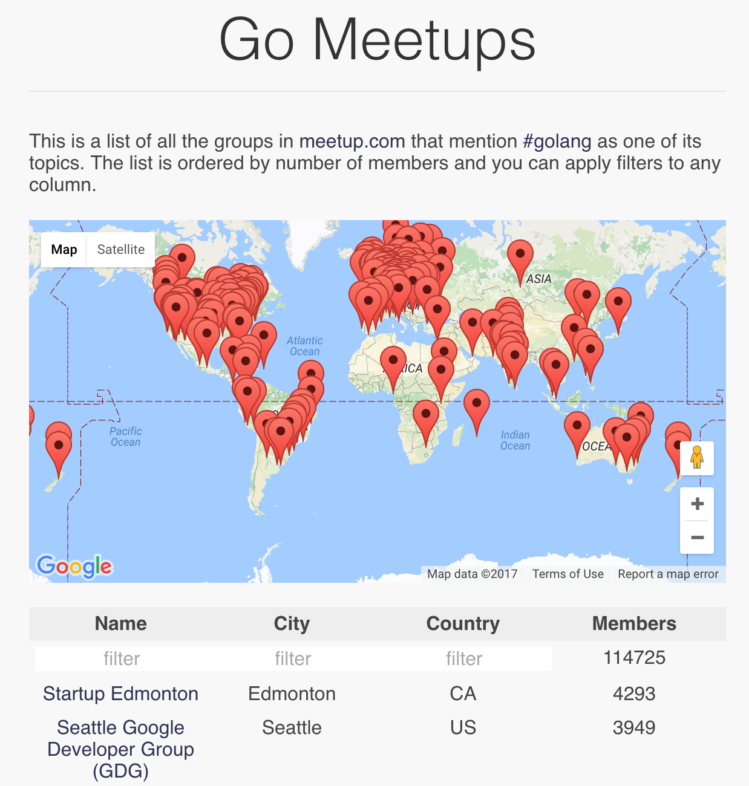

golang-groups
=============

This is the implementation of a web page showing all the Go meetup groups around the world.
It uses the Meetup API and runs on App Engine.

I originally created this as a demo for a talk I gave at GoSV in San Mateo.
There's some [slides](http://go-talks.appspot.com/github.com/campoy/golang-groups/talk/talk.slide)

### Disclaimer

This is not an official Google product (experimental or otherwise), it is just
code that happens to be owned by Google.

